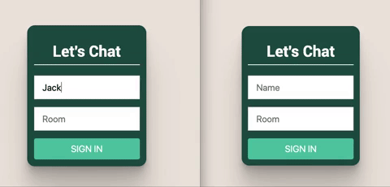

[](https://app.netlify.com/sites/festive-montalcini-48c157/deploys)

# React chat app

# [Live site](https://festive-montalcini-48c157.netlify.app/)

Real-time chat app that allows users to:
* Select a name and room to use;
* Send and receive messages;
* See who else has joined a room;



* Technologies used: *React, Node.js, Socket.io, Heroku, Netlify*

## Installation Instructions

1. Fork this repository, clone to your local machine then change into the directory:
```
$ git clone git@github.com:davmcgregor/react-chat-app.git
$ cd react-chat-app
```
2. Load dependencies and run the app for both the client and server directories:
```
$ npm install
$ npm start
```
3. Open multiple windows to send messages as different users.